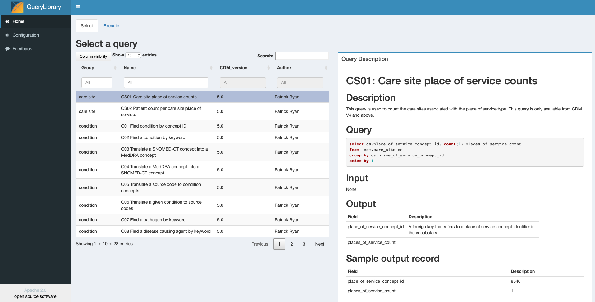
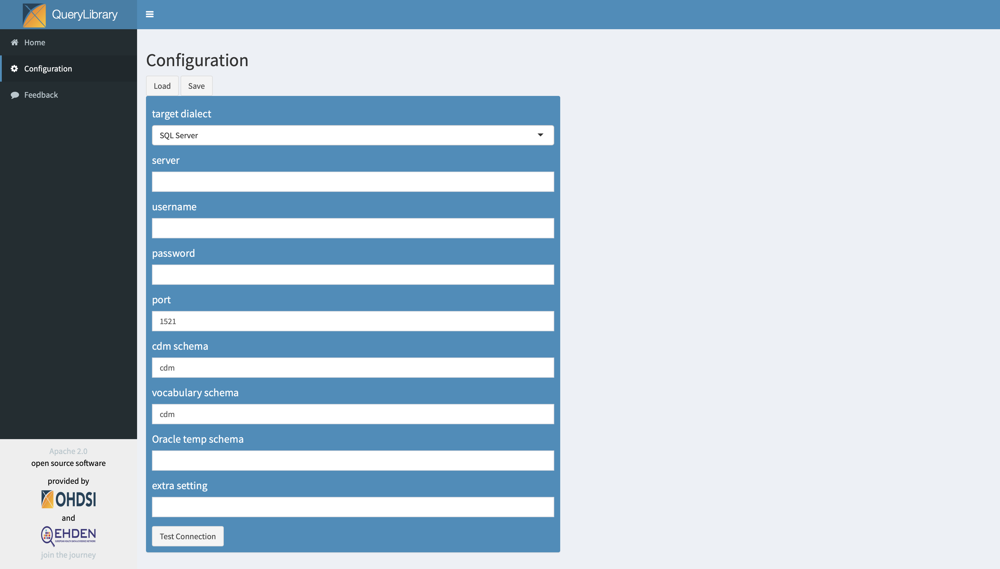
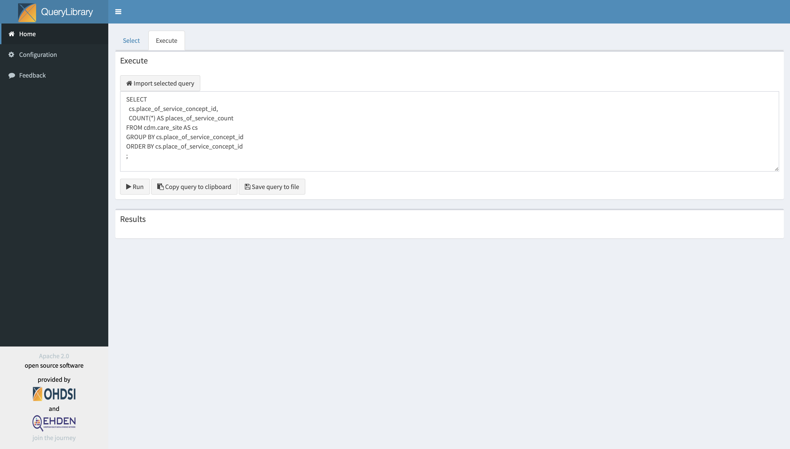

# Introduction

The QueryLibrary R-package is a repository of OMOP-CDM queries created and validated by the OHDSI community. The purpose of the library is to help new users to learn how to query the CDM. The query library can be used for training purposes, but will also be a valuable resource for the more experienced users. The tool utomatically renders the queries to the dialect, cdm and vocabulary schemas as specified in the configuation settings. Furthermore, it can execute the query against a user's database.

In this vignette we first explain how to install the tool and then demonstrate its use.

# Installation

Running the package requires R with the package rJava installed. Also requires Java 1.6 or higher and you need to have the following dependencies installed in R:

 * SQLRender
 * DatabaseConnector
 * Shiny
  
To install the latest development version, install from GitHub:

```r
install.packages("devtools")
devtools::install_github("ohdsi/QueryLibrary")
```

Once installed, you can try out the Shiny app that comes with the package:

```r
library(QueryLibrary)
launchQueryLibrary()
```



# Configuration settings

First, you have to fill in the configuration settings by clicking on configuration in the menu. 



The configuration section allows the user to set the dialect and other connection details for the CDM. This settings file can be saved and loaded using the buttons on the top of the page. The cdm and vocabulary schema will be filled in automatically in parameretised queries. 

# Selecting and running a query

Using the library table the user can select a query. The markdown file of the query can be see on the right. The Execute tab allows the user to import the selected query, edit the query (the window can be made bigger if needed), run, copy, and save the query. The tool will show a counter when the query is running and will show the results table below the query.


The path to the queries folder can be set in the global.R file. Here you can also set the default settings name and specify if you allow the executing of queries:

```r
queryFolder = "./queries"
configFilename = "settings.Rds"
allow_execute = TRUE
```

We added the allow_execute option since you may not want users to load and save settings files to the server or like to connect to databases when you install the Shiny Application on a public sever like data.ohdsi.org

# Extending the library

We would like to increase the number of queries in the library and like the community to drive this. If there are suggestions please post them in the issue tracker or even better do a pull request and we will review and approve your query.

To extend the library you can add a new Markdown file in the queries folder. The query file contains a description of the query, and explains the input variables, output table, and provides an output example. The following information is parsed from the markdown files using tags:

* Group. Allows to group queries, e.g. by domain
* Name. The name of the query in the search table.
* CDM-Version. The version this query runs on, e.g. >5.0
* Author. The person responsible for writing the query
* Query. The query is taken from the .Md file, rendered using SqlRender and is shown to the user in its preferred dialect. You should add @vocab or @cdm as parameters in the query if you refer to the cdm of vocab schema.

Note that if you add queries you have to follow the (OHDSI code style for SQL)[https://www.ohdsi.org/web/wiki/doku.php?id=development:ohdsi_code_style_for_sql]. 

We have added functionality to test all the queries against multiple database management systems (see extra/Test.R). This will be executed on your new query before we approve it.


# References
* Vignette: [Using QueryLibrary](https://github.com/OHDSI/QueryLibrary/blob/master/inst/doc/UsingQueryLibrary.pdf)
* Package manual: [QueryLibrary manual](https://github.com/OHDSI/QueryLibrary/blob/master/extras/QueryLibrary.pdf) 
* Developer questions/comments/feedback: <a href="http://forums.ohdsi.org/c/developers">OHDSI Forum</a>
* We use the <a href="https://github.com/OHDSI/QueryLibrary/issues">GitHub issue tracker</a> for all bugs/issues/enhancements

# Acknowledgement 
This work was performed within the European Health Data & Evidence Network ([EHDEN](https://www.ehden.eu)) project in collaboration with OHDSI. The European Health Data & Evidence Network has received funding from the Innovative Medicines Initiative 2 Joint Undertaking (JU) under grant agreement No 806968. The JU receives support from the European Union’s Horizon 2020 research and innovation programme and EFPIA.

